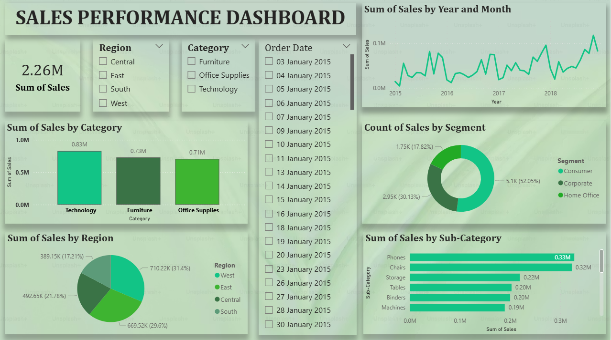

# SALES PERFORMANCE DASHBOARD – DOCUMENTATION & ANALYSIS

  

## 1. Dashboard Objective

- The Sales Performance Dashboard is created to analyse overall business sales performance using historical sales data.
- This dashboard helps users understand total sales, sales trend over time, category-wise sales, region-wise performance, customer segments, and top sub-categories.
- It provides a clear visual summary for decision-making and performance monitoring.

---

## 2. Filters and Slicers

- The dashboard includes interactive slicers to analyze data dynamically :

### Region Slicer
- Central
- East
- South
- West

**Purpose:**
- Allows users to analyse sales performance region-wise.

### Category Slicer
- Furniture
- Office Supplies
- Technology

**Purpose:**
- Helps filter sales data based on product categories.

### Order Date (Year & Date)

- Allows selection of specific dates or years.

**Purpose:**
- Enables time-based analysis such as daily, monthly, or yearly sales trends.

---

## 3. KPI – Total Sales

- Sum of Sales: 2.26M
- This KPI card shows the total sales value for the selected filters.

**Purpose:**
- Gives a quick overview of business revenue
- Helps management understand overall performance at a glance

---

## 4. Sum of Sales by Year and Month (Line Chart)

- This line chart displays sales trend over time from 2015 onwards.
- X-axis: Year
- Y-axis: Sum of Sales

**Analysis:**
- Sales show an overall upward trend
- Some fluctuations indicate seasonal demand
- Sales peak in later years, showing business growth

**Business Insight:**
- The company is growing year by year
- Certain months perform better, which can be used for future planning

---

## 5. Sum of Sales by Category (Column Chart)

This chart compares sales across three main categories:

- Technology – 0.83M (Highest)
- Furniture – 0.73M
- Office Supplies – 0.71M

**Analysis:**
- Technology is the top-performing category
- Furniture and Office Supplies have similar performance

**Business Insight:**
- Technology products generate maximum revenue
- Marketing focus can be increased on Technology category

---

## 6. Count of Sales by Segment (Donut Chart)

This donut chart shows sales distribution by customer segment:

- Consumer – 52.05% (5.1K)
- Corporate – 30.13% (2.95K)
- Home Office – 17.82% (1.75K)

**Analysis:**
- Consumer segment contributes more than half of total sales
- Corporate segment is the second highest

**Business Insight:**
- Consumers are the primary customers
- Corporate segment has growth potential

---

## 7. Sum of Sales by Region (Pie Chart)

This chart shows regional sales distribution:

- West – 710.22K (31.4%)
- East – 669.52K (29.6%)
- Central – 492.65K (21.78%)
- South – 389.15K (17.21%)

**Analysis:**
- West region generates the highest sales
- South region has the lowest contribution

**Business Insight:**
- Strong performance in West and East regions
- Improvement strategies needed for South region

---

## 8. Sum of Sales by Sub-Category (Horizontal Bar Chart)

This chart displays top sub-categories by sales:

 Top performing sub-categories:

- Phones – 0.33M
- Chairs – 0.32M
- Storage – 0.22M
- Tables – 0.20M
- Binders – 0.20M
- Machines – 0.19M

**Analysis:**
- Phones and Chairs are the best-selling sub-categories
- Machines generate comparatively lower sales

**Business Insight:**
- Inventory and promotions should focus on Phones and Chairs
- Low-performing sub-categories need review

---

## 9. Overall Dashboard Insights

- Total sales achieved: 2.26 Million
- Technology is the highest revenue category
- Consumer segment dominates sales
- West region performs best
- Phones are the top-selling sub-category
- Sales show positive growth over time

---

## 10. Conclusion

- The Sales Performance Dashboard provides a clear and interactive view of business performance.
- It helps identify top categories, regions, customer segments, and product sub-categories.
- This dashboard supports data-driven decisions, improves strategic planning, and enhances business growth.
